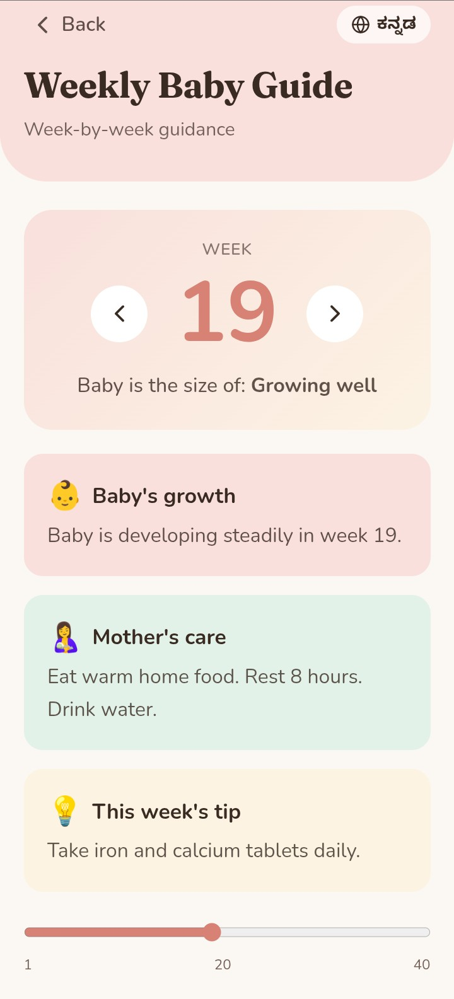
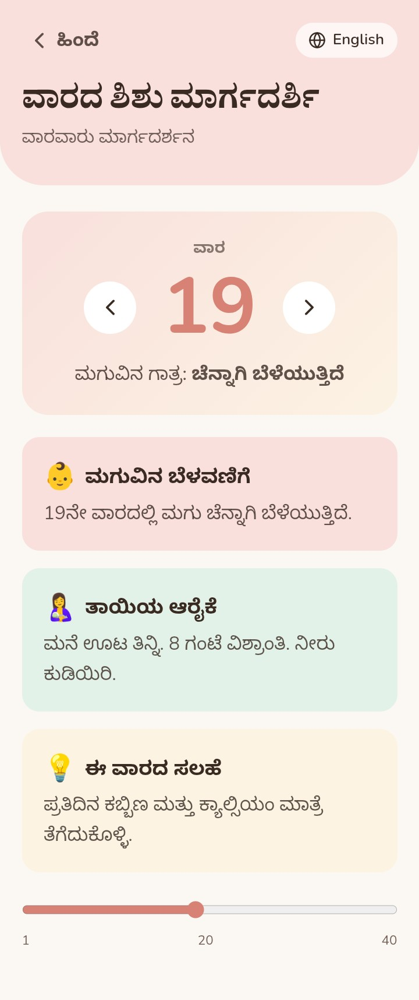

# Matru-Sneh Health

Matru-Sneh Health is an Application designed to support maternal healthcare for pregnant women in rural areas.

The application is simple, mobile-friendly, and works even without internet connectivity. It is specially designed for first-time smartphone users and rural mothers with an easy-to-use healthcare interface.

---

## Features

### 1. Kick Counter
- Large tap button to record baby movement
- Automatic kick time saving
- Debounce protection to avoid double taps
- Daily kick count tracking
- Weekly "Kicks per Hour" monitoring table

### 2. Check-up Countdown
- Add doctor visit, scan, or vaccination dates
- Shows remaining days for next check-up
- Reminder notification support
- Notifications continue after phone restart

### 3. Nutrition Plate
Daily nutrition checklist including:
- Ragi
- Greens
- Pulses
- Milk
- Fruits
- Water

Users can mark completed nutrition items daily.

### 4. Danger Signs Alert
Detects emergency maternal symptoms:
- High swelling
- Heavy bleeding
- Severe headache
- Fever
- Reduced baby movement

Shows emergency warning:

> "Danger Sign Detected – Visit Hospital Immediately"

### 5. Weekly Baby Guide
- Weekly pregnancy care tips
- Baby growth updates
- Kannada + English language support
- Easy reading format for rural users

---

## Technical Features

- Offline-first Progressive Web App 
- Add to Home Screen support
- Local Storage / IndexedDB support
- Reminder notifications
- Mobile-first responsive UI
- Large accessible buttons
- Simple healthcare dashboard
- First-time smartphone friendly design
- Android-compatible application
---

## Technology Stack

- React
- TypeScript
- Capacitor
- Progressive Web App 
- Android Studio
- Local Storage

---

## System Specifications

- Min SDK: 24
- Target SDK: 34
- Build Tool: Gradle 8+
- Android Deployment: Capacitor Android
- IDE Used: Android Studio
- Package Manager: npm

---

## Development Information

The application was developed using React with Capacitor for cross-platform Android deployment. Android Studio was used for APK generation and device testing.

---
## Project Goal

The goal of Matru-Sneh Health is to provide accessible maternal healthcare support for rural pregnant women through a lightweight offline-capable mobile application.

---
## 📸 Screenshots

### Home Screen

### Home Screen(kannada)

### Kick Counter

### Nutrition Tracker

### Checkup Countdown

### Danger Alert

### Weekly Guide (English)

### Weekly Guide (Kannada)

