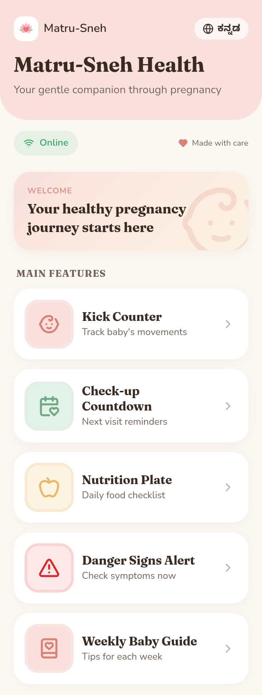
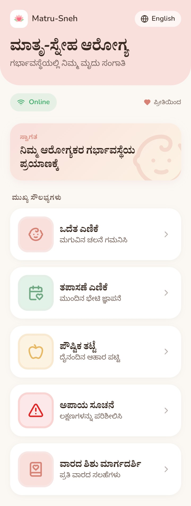
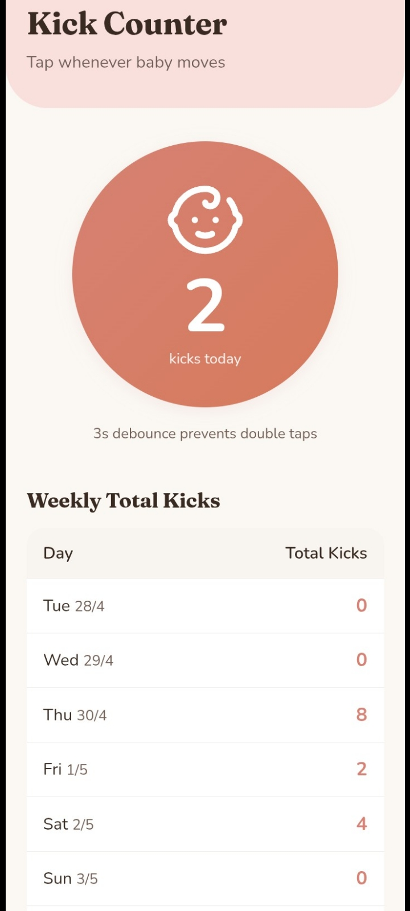
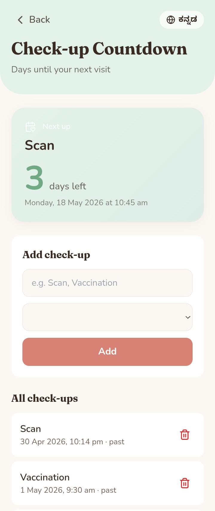

## 🌸Matru-Sneh Health

Matru-Sneh Health is a maternal healthcare support application designed for pregnant women in rural areas.
It is a lightweight, offline-first mobile application built to help users track essential pregnancy health activities easily without constant internet access.

The application is designed for first-time smartphone users with a simple, accessible, and mobile-friendly interface.# Matru-Sneh Health

---

## 🚀 Key Features

### 1. Kick Counter
- Large tap button to record baby movement
- Automatic kick time saving
- Debounce protection to avoid double taps
- Daily kick count tracking
- Weekly "Kicks per Hour" monitoring table

### 2. Check-up Countdown
- Add doctor visit, scan, or vaccination dates
- Shows remaining days for next check-up
- Reminder notification support
- Notifications continue after phone restart

### 3. Nutrition Plate
Daily nutrition checklist including:
- Ragi
- Greens
- Pulses
- Milk
- Fruits
- Water

Users can mark completed nutrition items daily.

### 4. Danger Signs Alert
Detects emergency maternal symptoms:
- High swelling
- Heavy bleeding
- Severe headache
- Fever
- Reduced baby movement

Shows emergency warning:

> "Danger Sign Detected – Visit Hospital Immediately"

### 5. Weekly Baby Guide
- Weekly pregnancy care tips
- Baby growth updates
- Kannada + English language support
- Easy reading format for rural users

---

## Technical Features

- Offline-first Progressive Web App 
- Add to Home Screen support
- Local Storage / IndexedDB support
- Reminder notifications
- Mobile-first responsive UI
- Large accessible buttons
- Simple healthcare dashboard
- First-time smartphone friendly design
- Android-compatible application
  
---

## 🛠️ Technology Stack

- React
- TypeScript
- Capacitor(Android Deployment)
- Progressive Web App 
- Android Studio
- Local Storage

---

## 📱 Application Type

Offline-first mobile application
Progressive Web App (PWA)
Android-compatible via Capacitor
Responsive UI optimized for low-end devices

---

## ⚙️ System Specifications

- Min SDK: 24
- Target SDK: 34
- Build Tool: Gradle 8+
- Android Deployment: Capacitor Android
- IDE Used: Android Studio
- Package Manager: npm

---

## 📂 Project Structure

matru-sneh-health/
│
├── src/
│   ├── components/
│   ├── pages/
│   ├── utils/
│   ├── assets/
│
├── android/
├── public/
├── screenshots/
├── package.json
├── README.md

---

## Development Information

The application was developed using React with Capacitor for cross-platform Android deployment. Android Studio was used for APK generation and device testing.

---

## Project Goal

The goal of Matru-Sneh Health is to provide accessible maternal healthcare support for rural pregnant women through a lightweight offline-capable mobile application.

---

## 🎯 Project Objective 
To provide a simple, offline-capable maternal health assistant that helps rural pregnant women track essential health activities without requiring continuous internet access.

---

## 💡 Future Improvements

AI-based pregnancy risk prediction
Voice-based navigation for non-literate users
Integration with government health systems
Multi-language expansion
Offline emergency SMS alerts

---

## 📸 Screenshots

### Home Screen

### Home Screen(kannada)

### Kick Counter

### Nutrition Tracker

### Checkup Countdown

### Danger Alert

### Weekly Guide (English)

### Weekly Guide (Kannada)

---

